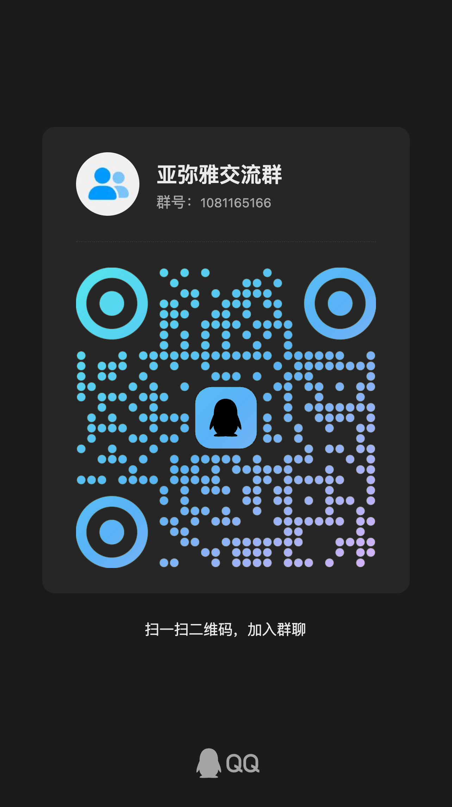

# GPT-Claude CTF 逆向工程 Prompt 模板

<div align="center">



**亚弥雅交流群** | 群号：1081165166

*扫描上方二维码加入群聊*

</div>

---

## 项目概述

本仓库提供专业级的 **CTF（Capture The Flag）逆向工程 Prompt 模板**，专为双框架兼容性设计 —— 可在 **Claude Code** 和 **Codex** CLI 智能体上无缝运行。

### 核心特性

- **双框架兼容**：单一模板设计，同时支持 Claude Code（Anthropic）和 Codex（OpenAI）CLI 智能体
- **全面覆盖**：完整支持 CTF 全类别，包括逆向工程、Pwn、密码学、Web、安全取证、隐写术、移动安全、物联网和云安全
- **专业工具链**：集成 IDA Pro、Ghidra、Radare2、GDB、pwndbg、angr、Z3、Triton、Frida 等工具参考
- **科研级设计**：结构化设计，适用于学术安全研究、CTF 竞赛备赛和漏洞分析
- **双语文档**：提供英文和简体中文双语 README

---

## 快速开始

### 1. 选择你的框架

**Claude Code 用户：**
```bash
# 复制 Claude Code Prompt 模板
cp Claude-CTF-Reverse-Prompt.md ~/.claude/prompts/ctf-reverse.md

# 或在 Claude Code 配置中设置为系统提示词
```

**Codex 用户：**
```bash
# 复制 Codex Prompt 模板
cp Codex-CTF-Reverse-Prompt.md ~/.codex/prompts/ctf-reverse.md

# 或在 Codex 配置中设置为系统提示词
```

### 2. Windows 快捷工具

使用提供的批处理脚本进行快速模板管理：

```batch
# CMD 版本
prompt-tool.bat

# PowerShell 版本（增强功能）
powershell -ExecutionPolicy Bypass -File prompt-tool.ps1
```

---

## 文件结构

```
git内容/
├── Claude-CTF-Reverse-Prompt.md    # Claude Code 版本
├── Codex-CTF-Reverse-Prompt.md     # Codex 版本
├── prompt-template.md              # 可配置模板
├── config.json                     # 配置文件
├── prompt-tool.bat                 # Windows CMD 工具
├── prompt-tool.ps1                 # Windows PowerShell 工具
├── README.md                       # 英文文档
├── README_zh.md                    # 中文文档
└── b2b81cd407357da51e7990223fe6cf9d.png  # QQ群二维码
```

---

## 支持的 CTF 类别

| 类别 | 描述 | 工具 |
|------|------|------|
| **RE** | 逆向工程 | IDA Pro, Ghidra, Radare2, objdump |
| **Pwn** | 二进制漏洞利用 | pwntools, pwndbg, ROPgadget, one_gadget |
| **Crypto** | 密码学分析 | Z3, angr, PyCryptodome, gmpy2 |
| **Web** | Web 安全 | Burp Suite, SQLMap, XSS  payloads |
| **Forensics** | 数字取证 | Volatility, Autopsy, strings, binwalk |
| **Steganography** | 隐写术 | steghide, zsteg, binwalk |
| **Mobile** | 移动安全 | Jadx, Frida, apktool, objection |
| **IoT** | 物联网安全 | QEMU, binwalk, Firmadyne |
| **Cloud** | 云安全 | Pacu, ScoutSuite, CloudBrute |

---

## 工具配置

### Claude Code 环境

```bash
# 推荐的 Claude Code 配置
export CLAUDE_TRUSTED_DIRECTORIES="/Volumes/MacStorage/测试内绘"

# 将 prompt 放入 Claude 自定义指令位置
```

### Codex 环境

```bash
# Codex CLI 智能体配置
codex configure --system-prompt-file ./Codex-CTF-Reverse-Prompt.md
```

---

## Prompt 功能

模板使 AI 智能体能够执行：

- **静态分析**：二进制格式识别、函数识别、字符串提取、控制流分析
- **动态分析**：调试、断点管理、内存检查、运行时行为追踪
- **解密与解码**：XOR 暴力破解、Base64 解码、RC4/AES 分析、自定义密码恢复
- **符号执行**：Z3 约束求解、angr 路径探索、Triton 混合执行分析
- **漏洞利用开发**：ROP 链构建、UAF 漏洞利用、格式化字符串攻击
- **反调试绕过**：环境检测、虚拟机检测、反追踪技术
- **脱壳与反混淆**：UPX、VMProtect、Themida 分析、控制流扁平化恢复

---

## 使用声明

本项目仅提供用于 **CTF 竞赛备赛和授权安全研究**。

**禁止用途：**
- 商业软件破解
- 未授权系统访问
- 真实环境攻击部署
- 盗版或授权绕过

请遵守负责任的安全研究实践规范。

---

## 贡献

欢迎贡献！请提交 Issues 或 Pull Requests，包括：
- 扩展 CTF 类别覆盖
- 工具链更新
- 文档改进
- 新框架支持

---

## 社区

<div align="center">

**加入我们的社区，讨论、获取更新、开展协作**


**亚弥雅交流群**
QQ 群号：1081165166

</div>

---

## 致谢

- Claude Code by Anthropic
- Codex by OpenAI
- CTF 社区及竞赛主办方
- 所有贡献者和研究者

---

*最后更新：2026-07-09*
